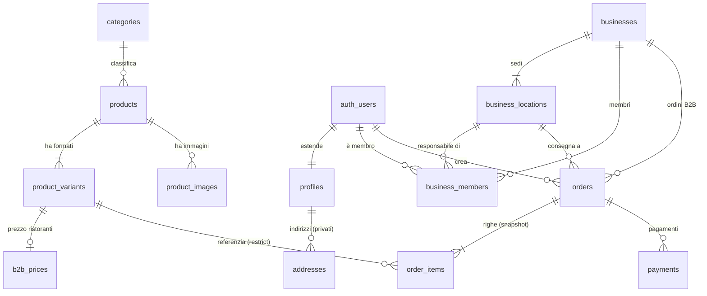

# Collaudo del comportamento — Schema Forge (2026-07-25)

Collaudo del **Flusso 1 conversazionale** (la casella rimasta vuota in `STATO.md`) più `evolve`, prove avversarie, buchi di copertura e guardiani. Banco: `banco-prova-pastificio/` (gitignorato). La domanda del collaudo non è "lo schema è buono?" ma: **un agente meno capace, seguendo solo `SKILL.md` e `references/`, sarebbe arrivato allo stesso punto?** Ogni decisione registra la sua origine: `[SKILL]` = imposta da una regola scritta · `[MIO]` = buon senso non scritto = buco nelle istruzioni.

---

## FASE 1 — Flusso 1 sul brief "Pastificio Ferrero"

### Passo `model`

- Letti brief e handoff precedenti (`docs/handoff/`): nessun handoff, progetto nuovo. `[SKILL]` — la procedura lo impone.
- **Buco trovato subito**: `SKILL.md` §Comando→procedura dice «genero l'ERD con `node <skill>/scripts/erd.mjs --from-model`», ma **il flag `--from-model` non esiste**: `erd.mjs` legge solo dal database reale, che al passo `model` non esiste ancora. L'ERD dello Specchio va disegnato a mano dall'LLM — in contraddizione con «Il diagramma non lo disegna l'LLM» (§Come parla Schema Forge). Registrato; ERD sotto dichiarato **disegnato a mano**.

#### Sostantivi del dominio (classificazione imposta da SKILL.md: entità · attributo · relazione · lookup)

| Sostantivo | Classe | Note |
|---|---|---|
| pasta / prodotto | entità → `products` | pattern-ecommerce |
| formato (500g, 1kg, vaschetta) | entità → `product_variants` | `[SKILL]` prodotto ≠ variante, prezzo sulla variante |
| prezzo privati / prezzo ristoranti | attributo della variante + **listino B2B** | `[MIO]` — la skill non parla di listini differenziati |
| stagionalità ("spariscono e tornano") | attributo (`is_published`) | pattern ha `is_published`; il divieto di cancellare viene da `on delete restrict` sugli `order_items` |
| cliente privato | entità → `profiles` (+ `addresses`) | `[SKILL]` |
| ristorante | entità → `businesses` | `[MIO]` — il pattern non ha B2B |
| sede | entità → `business_locations` | `[MIO]` |
| titolare / responsabile sede | relazione con ruolo → `business_members` | `[SKILL]` parziale: rls-supabase pattern 3 (tenant) + 4 (role), ma la **composizione** (ruolo scoping per sede) non è scritta |
| ordine | entità → `orders` (macchina a stati) | `[SKILL]` |
| riga d'ordine | entità → `order_items` (snapshot) | `[SKILL]` regola d'oro dello snapshot |
| pagamento / carta / 30 giorni fattura | entità → `payments` (+ scadenza) | pattern ha `payments`; i termini di pagamento B2B `[MIO]` |
| magazzino (uno, poi due) | attributo (`stock_quantity` su variante) | `[SKILL]`: «giacenza colonna sulla variante solo se il magazzino è uno e non ci sono prenotazioni» + YAGNI con nota di aggancio nell'handoff |
| listino che cambia ogni mese | non è un'entità: lo storico lo garantisce lo **snapshot** negli ordini | `[SKILL]` |

#### Mappa della proprietà dei dati (chi possiede la riga — imposta da SKILL.md, Flusso 1 passo 3)

| Tabella | Possessore della riga | Chi legge | Chi scrive |
|---|---|---|---|
| `categories`, `products`, `product_variants`, `product_images` | il pastificio | tutti (se pubblicato); staff tutto | solo staff |
| `b2b_prices` | il pastificio | solo utenti B2B autenticati + staff | solo staff |
| `profiles` | l'utente | l'utente | l'utente |
| `addresses` | l'utente privato | l'utente | l'utente |
| `businesses`, `business_locations` | il pastificio (li registra lui) | i membri del ristorante + staff | solo staff |
| `business_members` | il pastificio | il membro (la propria riga) + staff | solo staff |
| `staff_members` | il pastificio | il membro (la propria riga) | nessuno dal client |
| `orders` privato | l'utente | l'utente | creazione dal client, modifica solo via server |
| `orders` B2B | la sede | titolare: tutte le sedi; responsabile: la sua | come sopra |
| `order_items`, `payments` | seguono l'ordine | chi vede l'ordine | vedi ordini |

### Specchio del dominio — STOP (come impone la Legge n°1)

> **Riformulazione in italiano semplice.**
> Il Pastificio Ferrero vende pasta fresca online a due pubblici. I **privati** si registrano, comprano dal catalogo ai prezzi di listino e pagano subito con carta. I **ristoranti** sono aziende registrate dal pastificio: hanno un listino riservato più basso, pagano a 30 giorni con fattura, e hanno più **sedi** con indirizzi di consegna diversi. Dentro un ristorante ci sono due ruoli: il **titolare**, che vede gli ordini di tutte le sedi, e il **responsabile di sede**, che vede e fa solo quelli della sua.
> Ogni **prodotto** (es. "tagliatelle") esiste in più **formati** (500g, 1kg, vaschetta famiglia), e il prezzo sta sul formato, non sul prodotto. I prodotti stagionali d'estate **si nascondono dal sito, non si cancellano**: gli ordini vecchi devono continuare a mostrare cosa fu comprato.
> Un **ordine** congela dentro di sé prezzi, nomi e indirizzo del momento (snapshot): il listino che cambia ogni mese non riscrive il passato. L'ordine è modificabile finché non parte la spedizione.
> Il magazzino oggi è uno: la giacenza sta sul formato. Il secondo magazzino, quando arriverà, sarà una tabella di inventario separata (nota nell'handoff, non si costruisce ora).

ERD Mermaid dello Specchio (**disegnato a mano**, vedi buco `--from-model`):

**Domande al committente** (le ambiguità del brief NON risolte in silenzio):

1. **Modifica dell'ordine.** Il brief dice "modificabile finché non spediamo", ma il nostro modello di riferimento tratta l'ordine come uno snapshot in sola lettura dopo la creazione, e le modifiche ai prezzi passano dal server. Va bene se la modifica passa dal sito (server), che ricalcola i prezzi correnti a ogni modifica, ed è bloccata dal database stesso appena l'ordine risulta spedito?
2. **Listino ristoranti.** Il prezzo B2B è unico per tutti i ristoranti, o negoziato per singolo ristorante? E serve conservare lo storico dei listini, o basta che ogni ordine congeli i prezzi del momento?
3. **Visibilità dei prezzi B2B.** I prezzi riservati ai ristoranti devono restare invisibili al pubblico e ai privati?
4. **Stagionalità.** Basta un interruttore manuale "pubblicato sì/no", o volete date di inizio/fine stagione automatiche?
5. **Carrello.** Serve un carrello salvato sul server (sopravvive al cambio di dispositivo, tabelle e permessi in più) o basta il carrello nel browser?
6. **Categorie.** I prodotti vanno organizzati in categorie (es. pasta ripiena, pasta lunga)? Piatte o ad albero?
7. **Fatture.** La fattura a 30 giorni la emette il sito o il vostro gestionale/commercialista? A noi serve solo registrare il metodo di pagamento e la scadenza?
8. **Chi registra i ristoranti.** Ristoranti, sedi e utenti dei ristoranti li create voi (il pastificio), o si registrano da soli? Il responsabile di sede può ordinare **solo** per la sua sede?
9. **Ordini B2B e pagamento.** Per i ristoranti l'ordine viene spedito **prima** di essere pagato (fattura a 30 giorni): confermate che lo stato di pagamento viaggia separato dallo stato di consegna?
10. **Secondo magazzino.** "Entro l'anno" è deciso (predisponiamo ora l'inventario multi-magazzino) o è un'ipotesi (teniamo semplice e documentiamo come si aggancerà)?

--- RISPOSTE DEL COMMITTENTE (parte recitata dal collaudatore, blocco dichiarato) ---

1. Sì: modifica dal sito finché non è spedito, ai prezzi del momento della modifica. Dopo la spedizione niente si tocca.
2. Listino B2B **unico** per tutti i ristoranti. Lo storico dei listini non ci serve: fa fede quello che c'è scritto sull'ordine.
3. Sì: i prezzi ristorante non devono vedersi da fuori. Ogni ristorante loggato li vede.
4. Interruttore manuale: decidiamo noi quando togliere e rimettere un prodotto.
5. Carrello semplice, nel browser: se si perde cambiando telefono pazienza.
6. Sì, categorie **piatte**: pasta ripiena, pasta lunga, gnocchi, sughi.
7. Le fatture le fa il commercialista col suo gestionale. Voi registrate solo che il ristorante paga "a fattura" e la scadenza.
8. Li registriamo **noi**. Il responsabile ordina solo per la sua sede, il titolare per tutte.
9. Confermato: la merce parte, la fattura si paga dopo. Pagamento e consegna separati.
10. Non è ancora deciso niente: tenete semplice, basta che dopo non sia un disastro aggiungerlo.

--- FINE RISPOSTE ---

**Conferma dello Specchio**: ottenuta (committente recitato). Il DDL può iniziare — la Legge n°1 è rispettata.

### Decisioni di modellazione derivate (con origine)

| Decisione | Origine |
|---|---|
| Prezzo e giacenza sulla **variante**, non sul prodotto | `[SKILL]` pattern-ecommerce, decisione chiave |
| Stagionali con `is_published`, mai cancellati; `on delete restrict` da `order_items.variant_id` protegge lo storico | `[SKILL]` pattern-ecommerce |
| Listino B2B = tabella `b2b_prices` separata (1:1 con la variante) e non colonna su `product_variants`: la RLS è **per riga**, non per colonna — una colonna `b2b_price_cents` sarebbe leggibile da `anon` via PostgREST | `[MIO]` — né rls-supabase.md né pattern-ecommerce.md parlano di visibilità per colonna |
| Snapshot in `order_items` (nome, formato, prezzo, aliquota) + indirizzo copiato in `orders` | `[SKILL]` regola d'oro |
| Macchina a stati ordini `pending→confirmed→shipped→delivered` + `cancelled`, transizioni bloccate da trigger | `[SKILL]` modellazione.md (macchine a stati) — ma la **separazione** stato-consegna / stato-pagamento per il B2B è `[MIO]`: il pattern ha `paid` dentro la catena, che per un B2B a 30 giorni è falso |
| Modifica ordine: nessuna policy `update` client; blocco a livello DB (trigger su `order_items` se l'ordine non è più modificabile) | `[SKILL]` parziale: "gli ordini non si modificano dal client" c'è; il **conflitto col brief** l'ho dovuto vedere io e portarlo nello Specchio — nessuna regola scritta dice "se il brief contraddice il pattern, sollevalo come domanda" |
| `bigint` per tutti i `*_cents` | `[SKILL]` modellazione.md riga Denaro (regola scritta, non calcolo mio) |
| `quantity`/`stock_quantity` in `bigint` | `[MIO]` per coerenza col banco precedente — la reference motiva solo il denaro (→ Fase 7) |
| Giacenza = colonna sulla variante (un magazzino, niente riserve), multi-magazzino solo nota di aggancio nell'handoff | `[SKILL]` pattern-ecommerce §Inventario + §YAGNI |
| Ruoli staff in tabella `staff_members` letta da `security definer`, mai colonna scrivibile dall'utente | `[SKILL]` rls-supabase pattern 4 |
| `id` surrogato anche su `b2b_prices` e `staff_members` (con `unique` sulla chiave naturale) | `[SKILL]` modellazione.md «chiave primaria sempre `id`» — applicata alla lettera anche dove la chiave naturale sarebbe bastata |
| Scoping titolare/responsabile: funzione `security definer` che compone tenant+ruolo+sede | `[MIO]` in composizione — i pattern 3 e 4 esistono separati, l'incrocio con la sede non è scritto |
| Carrello lato client: zero tabelle | `[SKILL]` pattern-ecommerce §Carrello (decisione da prendere nello Specchio — presa lì) |
| Fatturazione fuori scope, solo `payment_method` + `due_at` | dal committente (domanda 7) |

### Esecuzione `forge` → `seed` → `verify` → `types` → `handoff`

- **`forge`**: una migrazione (`20260725100000_pastificio_base.sql`), ordine canonico rispettato, 14 tabelle tutte con `enable` + `force row level security` alla nascita, una policy per operazione e per ruolo. Config `.sqlfluff` e `squawk.toml` copiate nella radice del progetto `[SKILL]` (ma è un passo manuale dell'agente: nessuno script lo fa, e nessuno se ne accorgerebbe se saltato — già annotato in STATO.md §Aperto).
- **`seed`**: idempotente secondo la definizione scritta («due reset di fila = stesso stato»: verificato, conteggi identici). **Buco trovato**: la ri-esecuzione del seed su DB *caldo* fallisce a metà — l'`insert` delle righe dell'ordine ormai `shipped` fa scattare il trigger `BEFORE` di blocco **prima** che `on conflict do nothing` veda il conflitto. «`on conflict do nothing` ovunque» (modellazione.md §Seed) non basta quando esistono trigger di dominio. Lo stato resta identico (l'errore interrompe solo quello statement), ma un seed che erra non è un seed pulito. Non corretto (vincolo del collaudo): registrato qui e nell'handoff.
- **`verify`**: primo giro ROSSO su «tipi TypeScript» — **il Flusso 1 mette `verify` (passo 7) prima di `types` (passo 8), quindi il primo `verify` è sempre rosso su quel passo**. O il flusso inverte i due passi, o dichiara che il primo giro genera i tipi. Poi tre giri ROSSI per il 502 di `supabase db reset`: non l'instabilità saltuaria coperta dal ritentativo, ma il container `supabase_vector` in restart-loop (Docker Desktop). Risolto disabilitando analytics nel `config.toml` del banco (fuori dal gate). **Esito finale: GATE VERDE, 7 passi su 7**, residuo: 1 `issue` documentato (`using (true)` su `categories`, dato realmente pubblico).
- **`types`**: generati (`supabase gen types typescript --local`, 705 righe). Nota Windows: generati via Git Bash — la redirezione PowerShell scriverebbe CRLF e il confronto di `verify` fallirebbe. La skill non lo dice.
- **`handoff`**: scritto da template, tutte le sezioni compilate, zero `{{…}}`. ERD rigenerato dallo schema reale con `erd.mjs`.
- **pgTAP**: 12 test verdi, inclusi: scoping titolare (2 ordini) vs responsabile (1 ordine, sede propria), listino B2B invisibile a privati e anon, macchina a stati (`pending→delivered` rifiutato), righe di ordine spedito intoccabili anche da superutente.
