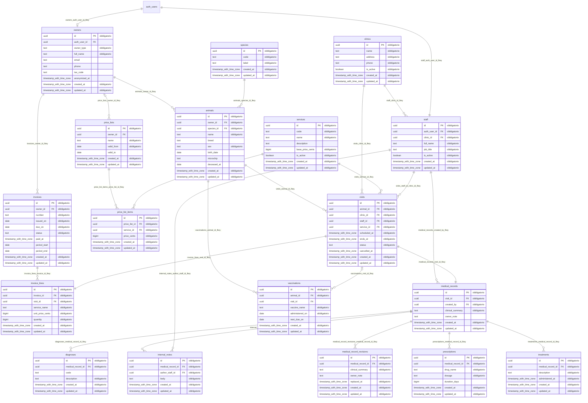

# Diagramma ER

> Generato da `scripts/erd.mjs` dallo schema reale. **Non modificare a mano**: rigeneralo.

```mermaid
erDiagram
    animals {
        uuid id PK "obbligatorio"
        uuid owner_id FK "obbligatorio"
        uuid species_id FK "obbligatorio"
        text name "obbligatorio"
        text breed
        text sex "obbligatorio"
        date birth_date
        text microchip
        date deceased_at
        timestamp_with_time_zone created_at "obbligatorio"
        timestamp_with_time_zone updated_at "obbligatorio"
    }
    clinics {
        uuid id PK "obbligatorio"
        text name "obbligatorio"
        text address "obbligatorio"
        text phone "obbligatorio"
        boolean is_active "obbligatorio"
        timestamp_with_time_zone created_at "obbligatorio"
        timestamp_with_time_zone updated_at "obbligatorio"
    }
    diagnoses {
        uuid id PK "obbligatorio"
        uuid medical_record_id FK "obbligatorio"
        text code
        text description "obbligatorio"
        timestamp_with_time_zone created_at "obbligatorio"
        timestamp_with_time_zone updated_at "obbligatorio"
    }
    internal_notes {
        uuid id PK "obbligatorio"
        uuid medical_record_id FK "obbligatorio"
        uuid author_staff_id FK "obbligatorio"
        text body "obbligatorio"
        timestamp_with_time_zone created_at "obbligatorio"
        timestamp_with_time_zone updated_at "obbligatorio"
    }
    invoice_lines {
        uuid id PK "obbligatorio"
        uuid invoice_id FK "obbligatorio"
        uuid visit_id FK "obbligatorio"
        text service_name "obbligatorio"
        bigint unit_price_cents "obbligatorio"
        bigint quantity "obbligatorio"
        timestamp_with_time_zone created_at "obbligatorio"
        timestamp_with_time_zone updated_at "obbligatorio"
    }
    invoices {
        uuid id PK "obbligatorio"
        uuid owner_id FK "obbligatorio"
        text number "obbligatorio"
        date issued_on "obbligatorio"
        date due_on "obbligatorio"
        text status "obbligatorio"
        timestamp_with_time_zone paid_at
        date period_start
        date period_end
        timestamp_with_time_zone created_at "obbligatorio"
        timestamp_with_time_zone updated_at "obbligatorio"
    }
    medical_record_revisions {
        uuid id PK "obbligatorio"
        uuid medical_record_id FK "obbligatorio"
        text clinical_summary "obbligatorio"
        text owner_note
        timestamp_with_time_zone replaced_at "obbligatorio"
        timestamp_with_time_zone created_at "obbligatorio"
        timestamp_with_time_zone updated_at "obbligatorio"
    }
    medical_records {
        uuid id PK "obbligatorio"
        uuid visit_id FK "obbligatorio"
        uuid created_by FK "obbligatorio"
        text clinical_summary "obbligatorio"
        text owner_note
        timestamp_with_time_zone created_at "obbligatorio"
        timestamp_with_time_zone updated_at "obbligatorio"
    }
    owners {
        uuid id PK "obbligatorio"
        uuid auth_user_id FK
        text owner_type "obbligatorio"
        text full_name "obbligatorio"
        text email
        text phone
        text tax_code
        timestamp_with_time_zone anonymized_at
        timestamp_with_time_zone created_at "obbligatorio"
        timestamp_with_time_zone updated_at "obbligatorio"
    }
    prescriptions {
        uuid id PK "obbligatorio"
        uuid medical_record_id FK "obbligatorio"
        text drug_name "obbligatorio"
        text dosage "obbligatorio"
        bigint duration_days
        timestamp_with_time_zone created_at "obbligatorio"
        timestamp_with_time_zone updated_at "obbligatorio"
    }
    price_list_items {
        uuid id PK "obbligatorio"
        uuid price_list_id FK "obbligatorio"
        uuid service_id FK "obbligatorio"
        bigint price_cents "obbligatorio"
        timestamp_with_time_zone created_at "obbligatorio"
        timestamp_with_time_zone updated_at "obbligatorio"
    }
    price_lists {
        uuid id PK "obbligatorio"
        uuid owner_id FK
        text name "obbligatorio"
        date valid_from "obbligatorio"
        date valid_to
        timestamp_with_time_zone created_at "obbligatorio"
        timestamp_with_time_zone updated_at "obbligatorio"
    }
    services {
        uuid id PK "obbligatorio"
        text code "obbligatorio"
        text name "obbligatorio"
        text description
        bigint base_price_cents "obbligatorio"
        boolean is_active "obbligatorio"
        timestamp_with_time_zone created_at "obbligatorio"
        timestamp_with_time_zone updated_at "obbligatorio"
    }
    species {
        uuid id PK "obbligatorio"
        text code "obbligatorio"
        text label "obbligatorio"
        timestamp_with_time_zone created_at "obbligatorio"
        timestamp_with_time_zone updated_at "obbligatorio"
    }
    staff {
        uuid id PK "obbligatorio"
        uuid auth_user_id FK "obbligatorio"
        uuid clinic_id FK "obbligatorio"
        text full_name "obbligatorio"
        text job_title "obbligatorio"
        boolean is_active "obbligatorio"
        timestamp_with_time_zone created_at "obbligatorio"
        timestamp_with_time_zone updated_at "obbligatorio"
    }
    treatments {
        uuid id PK "obbligatorio"
        uuid medical_record_id FK "obbligatorio"
        text description "obbligatorio"
        timestamp_with_time_zone administered_at "obbligatorio"
        timestamp_with_time_zone created_at "obbligatorio"
        timestamp_with_time_zone updated_at "obbligatorio"
    }
    vaccinations {
        uuid id PK "obbligatorio"
        uuid animal_id FK "obbligatorio"
        uuid visit_id FK
        text vaccine_name "obbligatorio"
        date administered_on "obbligatorio"
        date next_due_on
        timestamp_with_time_zone created_at "obbligatorio"
        timestamp_with_time_zone updated_at "obbligatorio"
    }
    visits {
        uuid id PK "obbligatorio"
        uuid animal_id FK "obbligatorio"
        uuid clinic_id FK "obbligatorio"
        uuid staff_id FK "obbligatorio"
        uuid service_id FK "obbligatorio"
        timestamp_with_time_zone scheduled_at "obbligatorio"
        timestamp_with_time_zone ends_at "obbligatorio"
        text status "obbligatorio"
        timestamp_with_time_zone cancelled_at
        timestamp_with_time_zone created_at "obbligatorio"
        timestamp_with_time_zone updated_at "obbligatorio"
    }
    owners ||--o{ animals : "animals_owner_id_fkey"
    species ||--o{ animals : "animals_species_id_fkey"
    medical_records ||--o{ diagnoses : "diagnoses_medical_record_id_fkey"
    medical_records ||--o{ internal_notes : "internal_notes_medical_record_id_fkey"
    staff ||--o{ internal_notes : "internal_notes_author_staff_id_fkey"
    invoices ||--o{ invoice_lines : "invoice_lines_invoice_id_fkey"
    visits ||--|| invoice_lines : "invoice_lines_visit_id_fkey"
    owners ||--o{ invoices : "invoices_owner_id_fkey"
    medical_records ||--o{ medical_record_revisions : "medical_record_revisions_medical_record_id_fkey"
    staff ||--o{ medical_records : "medical_records_created_by_fkey"
    visits ||--|| medical_records : "medical_records_visit_id_fkey"
    auth_users ||--o| owners : "owners_auth_user_id_fkey"
    medical_records ||--o{ prescriptions : "prescriptions_medical_record_id_fkey"
    price_lists ||--o{ price_list_items : "price_list_items_price_list_id_fkey"
    services ||--o{ price_list_items : "price_list_items_service_id_fkey"
    owners |o--o{ price_lists : "price_lists_owner_id_fkey"
    clinics ||--o{ staff : "staff_clinic_id_fkey"
    auth_users ||--|| staff : "staff_auth_user_id_fkey"
    medical_records ||--o{ treatments : "treatments_medical_record_id_fkey"
    animals ||--o{ vaccinations : "vaccinations_animal_id_fkey"
    visits |o--o{ vaccinations : "vaccinations_visit_id_fkey"
    animals ||--o{ visits : "visits_animal_id_fkey"
    clinics ||--o{ visits : "visits_clinic_id_fkey"
    services ||--o{ visits : "visits_service_id_fkey"
    staff ||--o{ visits : "visits_staff_id_clinic_id_fkey"
```
